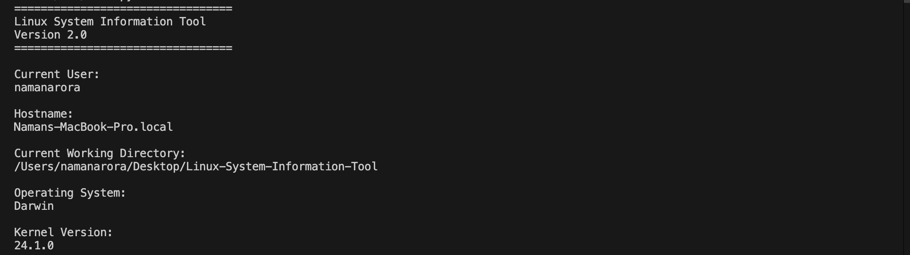
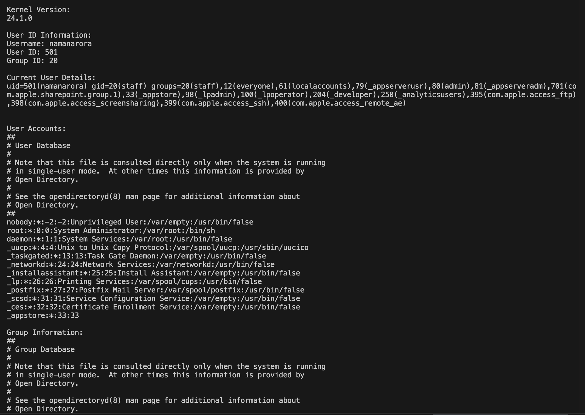
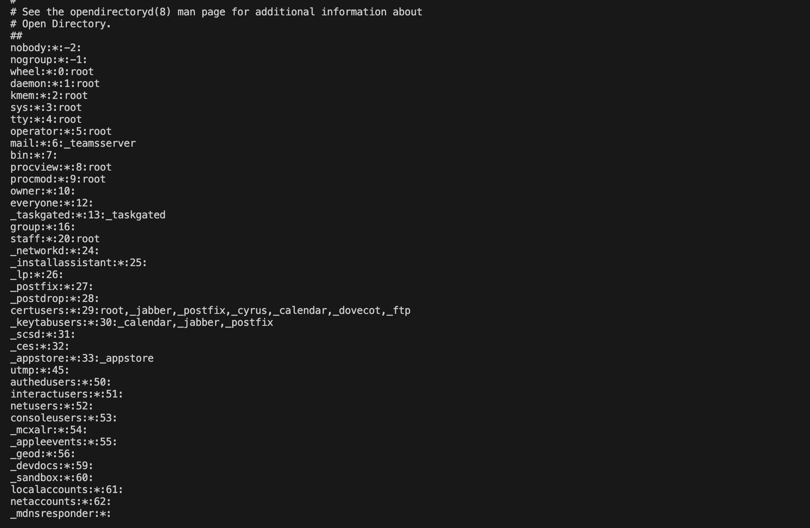
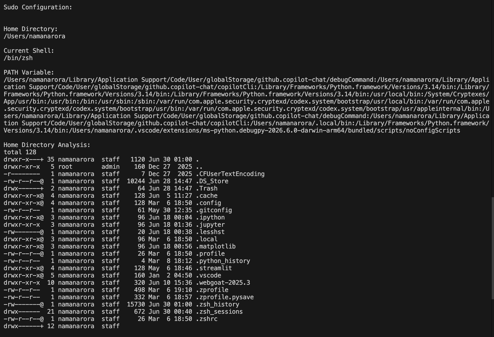
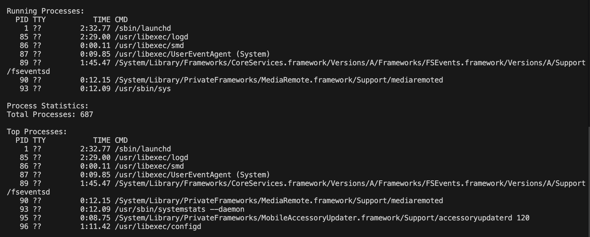
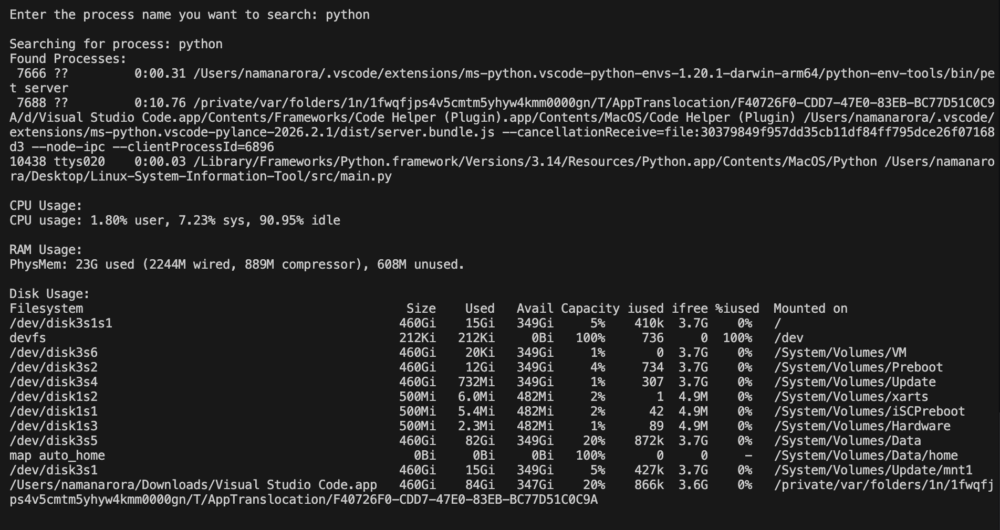
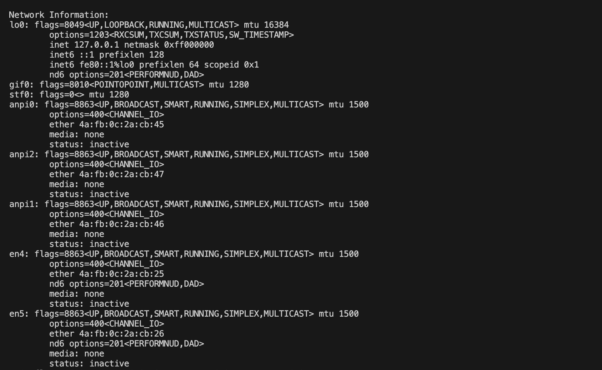
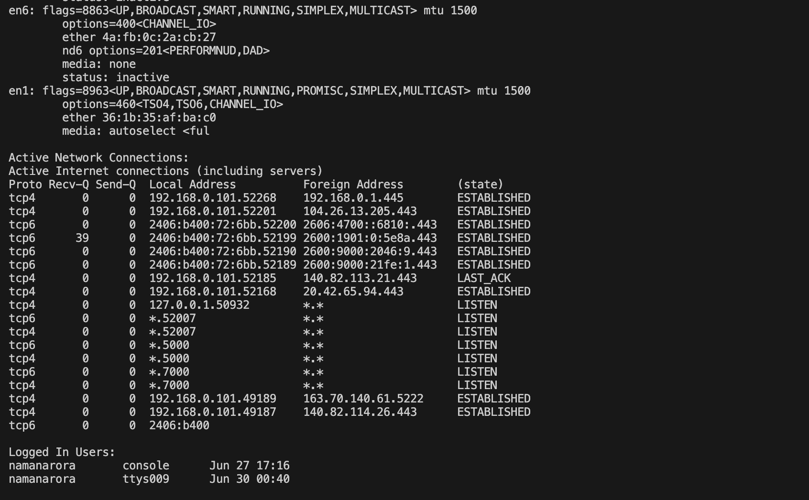
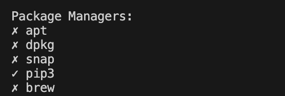

# Linux System Information Tool

A Python-based command-line system monitoring and administration tool built while learning Linux fundamentals. This project demonstrates how to retrieve and display important system information using native Linux/macOS commands and Python.

---

# Objective

Learn Linux by building a practical system monitoring and administration tool while studying Linux fundamentals through hands-on implementation.

---

# Features

## System Information

* Current User Information
* Hostname Information
* Current Working Directory
* Operating System Information
* Kernel Information

---

## User Information

* User ID Information
* Current User Details
* User Accounts Information
* Group Information
* Better User Enumeration
* Sudo Users Check

---

## Environment Information

* Home Directory
* Current Shell
* PATH Environment Variable
* Home Directory Analysis

---

## Process Monitoring

* Running Processes
* Process Count
* Process Search
* Top Running Processes

---

## System Monitoring

* CPU Usage Monitoring
* RAM Usage Monitoring
* Disk Usage Monitoring

---

## Network Information

* Network Interfaces Information
* Active Network Connections

---

## Storage Information

* Storage Information

---

## Package Information

* Package Manager Detection

---

## Login Information

* Logged In Users

---

# Linux Concepts Covered

* Filesystem Navigation
* Users
* Groups
* Permissions
* Environment Variables
* Processes
* Process Monitoring
* Process Management
* Job Control
* Linux Signals
* Daemons
* systemd
* Service Management
* Networking Basics
* Package Management

---

# Technologies Used

* Python
* Linux Commands
* macOS Commands
* subprocess
* os
* socket
* platform
* pwd

---

# Project Structure

```text
Linux-System-Information-Tool/
│
├── src/
│   └── main.py
│
├── docs/
│   ├── notes/
│   └── screenshots/
│
├── README.md
├── .gitignore
└── LICENSE (Optional)
```

---

# Installation

Clone the repository:

```bash
git clone https://github.com/aroranaman1003/Linux-System-Information-Tool.git
```

Go to the project directory:

```bash
cd Linux-System-Information-Tool
```

Run the project:

```bash
python3 src/main.py
```

---

# Sample Output

**Add screenshots here after uploading them to the repository.**

### Main Output











---

# What I Learned

Through this project, I gained practical experience with:

* Linux Filesystem
* Linux Users & Groups
* Environment Variables
* Process Management
* Job Control
* Linux Signals
* Daemons & systemd
* Package Management
* Linux Networking Basics
* Python subprocess Module
* Building Command-Line Applications
* Git & GitHub Workflow
* Project Documentation using Markdown

---

# Future Improvements

* Running Services Information
* Better Terminal Output Formatting
* Interactive Command-Line Menu
* Export System Information to a Report
* Export System Information to CSV 
* Cross-Platform Support (Linux/macOS)

---

# Learning Approach

```
Learn
   ↓
Build
   ↓
GitHub
   ↓
Document
```

---

# Version

**Version:** **2.0**

---

# Status

**Completed ✅**

---

## Author

**Naman Arora**

- Computer Science Engineering Student
- Aspiring AI Security Engineer
- Passionate about Cybersecurity, AI and Software Engineering

---

## License 

This project is licensed under the MIT License.